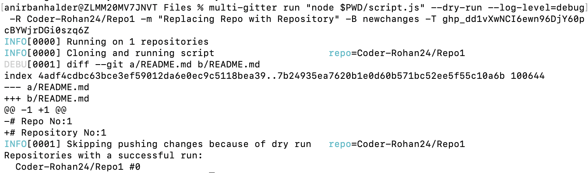
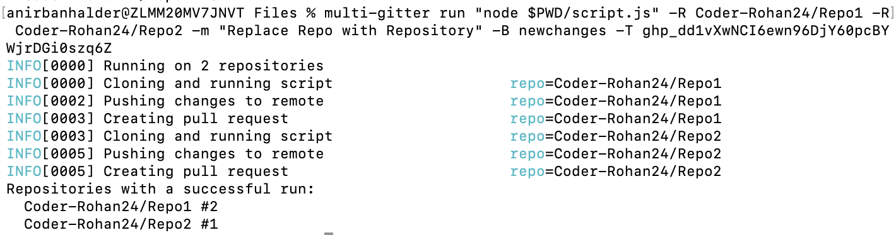
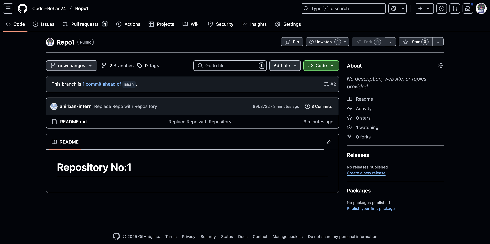
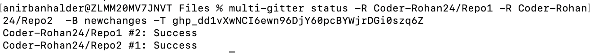
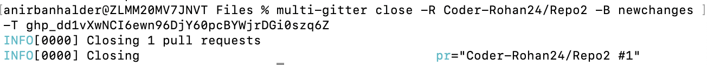
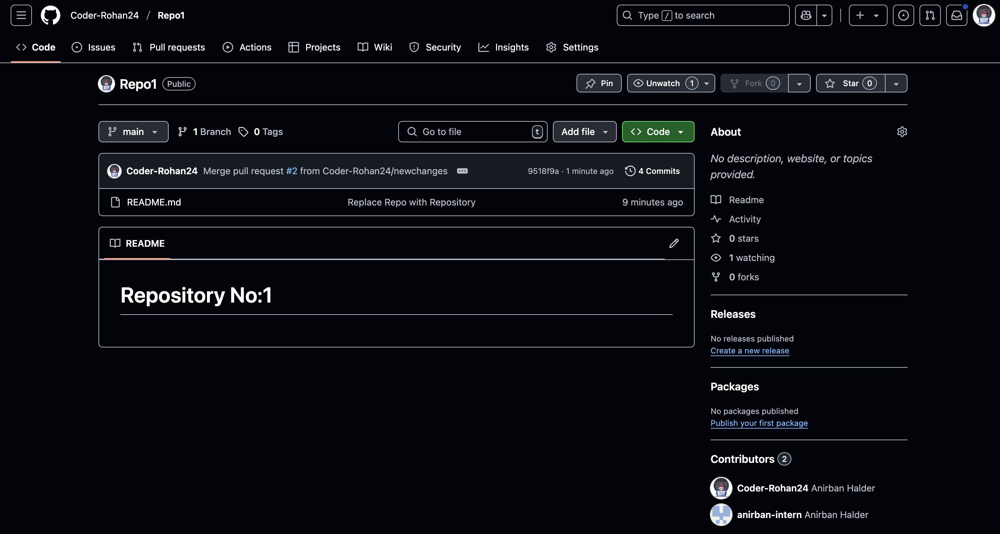
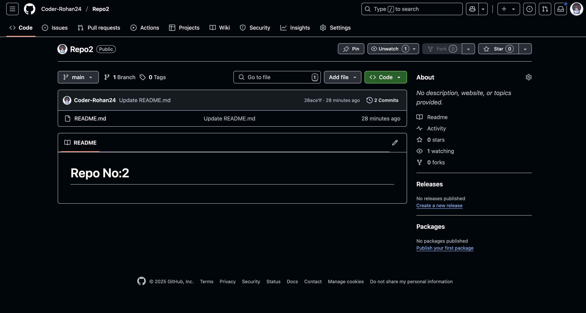

<!DOCTYPE html>
<html lang="en">
<head>
  <meta charset="UTF-8" />
  <meta name="viewport" content="width=device-width, initial-scale=1.0"/>
</head>
<body style="font-family: Arial, sans-serif; line-height: 1.6; max-width: 900px; margin: 2rem auto; padding: 0 1rem; color: #333;">

  <h1 style="color: #5b21b6;">Proof of Concept: Multi-Gitter Automation Across Repositories</h1>

  <h2 style="color: #5b21b6;">Objective</h2>
  

    This POC demonstrates how to use 
    <a href="https://github.com/lindell/multi-gitter" target="_blank" style="color: #5b21b6; text-decoration: none;">multi-gitter</a>
    to automate changes across multiple GitHub repositories.
  

  

    The task is to replace the word <strong>"Repo"</strong> with <strong>"Repository"</strong> in the
    <code style="background-color: #f4f4f4; padding: 2px 6px; border-radius: 4px; font-family: monospace;">README.md</code> files of:
  

  <ul>
    <li><code style="background-color: #f4f4f4;">Repo1</code>: Contains <code style="background-color: #f4f4f4;">Repo No:1</code></li>
    <li><code style="background-color: #f4f4f4;">Repo2</code>: Contains <code style="background-color: #f4f4f4;">Repo No:2</code></li>
  </ul>

  <h2 style="color: #5b21b6;">🛠️ Setup and Tools Used</h2>
  <ul>
    <li><code style="background-color: #f4f4f4;">multi-gitter</code> – Automates running scripts across multiple repositories</li>
    <li><code style="background-color: #f4f4f4;">Node.js</code> – Used to write and run the replacement script</li>
    <li>GitHub CLI / UI – To manage pull requests</li>
    <li>Repositories used: <code style="background-color: #f4f4f4;">Repo1</code>, <code style="background-color: #f4f4f4;">Repo2</code></li>
  </ul>

  <h2 style="color: #5b21b6;">📄 The Script (Two Versions)</h2>

There are two ways to perform the replacement across repositories. You can use either a general shell script or a Node.js script.

<h3 style="color: #5b21b6;">1️⃣ General Shell Script (my-script.sh)</h3>

This version uses <code style="background-color: #f4f4f4; padding: 2px 4px;">sed</code> and works on Linux or GNU environments. If you're using macOS, you may need <code style="background-color: #f4f4f4;">gnu-sed</code>.

<pre style="background-color: #f9f9f9; padding: 1rem; overflow-x: auto; border-left: 4px solid #5b21b6;"><code>#!/bin/bash

# Title: Replace text in all files

# Note: On macOS, use GNU sed instead of default BSD sed
# e.g., brew install gnu-sed and use gsed

find ./ -type f -exec sed -i -e 's/Repo/Repository/g' {} \;</code></pre>

<h3 style="color: #5b21b6;">2️⃣ Node.js Script (my-script.js)</h3>

This version uses Node.js and the <code style="background-color: #f4f4f4;">fs.promises</code> module to read and update files.

<pre style="background-color: #f9f9f9; padding: 1rem; overflow-x: auto; border-left: 4px solid #5b21b6;"><code>#!/usr/bin/env node

const { readFile, writeFile } = require("fs").promises;

async function replace() {
  let data = await readFile("./README.md", "utf8");
  data = data.replace("Repo", "Repository");
  await writeFile("./README.md", data, "utf8");
}

replace();</code></pre>

<h3 style="color: #5b21b6;">⚙️ Make the Script Executable</h3>

Before using either script with <code style="background-color: #f4f4f4;">multi-gitter</code>, you need to give it executable permission:

<pre style="background-color: #f9f9f9; padding: 1rem; border-left: 4px solid #5b21b6;"><code>chmod +x my-script.js   # For Node.js script
chmod +x my-script.sh   # For Shell script</code></pre>

Then you can use either with <code style="background-color: #f4f4f4;">multi-gitter</code> as needed:

<pre style="background-color: #f9f9f9; padding: 1rem; border-left: 4px solid #5b21b6;"><code>multi-gitter run "./my-script.sh" ...     # Shell
multi-gitter run "node $PWD/my-script.js" ... # Node</code></pre>

  <h2 style="color: #5b21b6;">🧪 Dry Run</h2>
  
Before applying real changes, test using the <code style="background-color: #f4f4f4;">--dry-run</code> flag:

  <pre style="background-color: #f9f9f9; padding: 1rem; border-left: 4px solid #5b21b6;"><code>multi-gitter run "node $PWD/my-script.js" --dry-run --log-level=debug \
  -R &lt;username&gt/Repo1 \
  -R &lt;username&gt/Repo2 \
  -m "Replace Repo with Repository" \
  -B newchanges \
  -T &lt;your-github-token&gt; \
  </code></pre>
  
  
✅ This ensures everything runs smoothly before making real commits.

  
Below is the terminal log

   
  <h2 style="color: #5b21b6;">🚀 Running the Script (Real Run)</h2>

  <pre style="background-color: #f9f9f9; padding: 1rem; border-left: 4px solid #5b21b6;"><code>multi-gitter run "node $PWD/my-script.js" \
  -R &lt;username&gt/Repo1 \
  -R &lt;username&gt/Repo2 \
  -m "Replace Repo with Repository" \
  -B newchanges \
  -T &lt;your-github-token&gt;</code></pre>

  
🟢 <strong>Success!</strong> Multi-gitter will automatically:

  <ul>
    <li>Clone each repository</li>
    <li>Run the script</li>
    <li>Commit the change on a new branch (<code style="background-color: #f4f4f4;">newchanges</code>)</li>
    <li>Open a pull request</li>
  </ul>
  
Below is the terminal log

   

  <h2 style="color: #5b21b6;">📸 Pull Request Created along with that "newchanges" branch has been created.</h2>
  <h3>Repo 1</h3>
  
  <h3>Repo 2</h3>
  

  <h2 style="color: #5b21b6;">📌 PR Status</h2>
  

  <h2 style="color: #5b21b6;">🔁 Merging or Closing PRs</h2>

  <h3 style="color: #5b21b6;">✅ Merged the PR for <code style="background-color: #f4f4f4;">Repo1</code></h3>
  
  
The word <strong>Repo</strong> has now changed to <strong>Repository</strong> in <code style="background-color: #f4f4f4;">Repo1</code>.

  <h3 style="color: #5b21b6;">❌ Closed the PR for <code style="background-color: #f4f4f4;">Repo2</code></h3>
  
  
No changes were merged. <code style="background-color: #f4f4f4;">Repo2</code> still contains the original content.

  <h2 style="color: #5b21b6;">✅ Final Results</h2>

  <h3 style="color: #5b21b6;">📂 <code style="background-color: #f4f4f4;">Repo1</code> (after merge):</h3>
  <pre style="background-color: #f9f9f9; padding: 1rem; border-left: 4px solid #5b21b6;">- Repo No:1
+ Repository No:1</pre>
  
  <h3 style="color: #5b21b6;">📂 <code style="background-color: #f4f4f4;">Repo2</code> (unchanged):</h3>
  <pre style="background-color: #f9f9f9; padding: 1rem; border-left: 4px solid #5b21b6;">Repo No:2</pre>
  
  <h2 style="color: #5b21b6;">📚 Summary</h2>
  <table style="width: 100%; border-collapse: collapse; margin: 1rem 0;">
    <thead>
      <tr>
        <th style="padding: 0.5rem; border: 1px solid #ccc; text-align: left;">Repo</th>
        <th style="padding: 0.5rem; border: 1px solid #ccc; text-align: left;">PR Action</th>
        <th style="padding: 0.5rem; border: 1px solid #ccc; text-align: left;">Final Result</th>
      </tr>
    </thead>
    <tbody>
      <tr>
        <td style="padding: 0.5rem; border: 1px solid #ccc;">Repo1</td>
        <td style="padding: 0.5rem; border: 1px solid #ccc;">Merged</td>
        <td style="padding: 0.5rem; border: 1px solid #ccc;">✅ Repository No:1</td>
      </tr>
      <tr>
        <td style="padding: 0.5rem; border: 1px solid #ccc;">Repo2</td>
        <td style="padding: 0.5rem; border: 1px solid #ccc;">Closed</td>
        <td style="padding: 0.5rem; border: 1px solid #ccc;">❌ Repo No:2</td>
      </tr>
    </tbody>
  </table>

  <h2 style="color: #5b21b6;">🧠 Why Use Multi-Gitter?</h2>
  <ul>
    <li>🚀 Automate updates across 10s or 100s of repositories</li>
    <li>📦 Commit, branch, and PR creation in one tool</li>
    <li>🔒 Works securely with GitHub tokens</li>
    <li>🧪 Supports dry-run testing before applying changes</li>
  </ul>

  <h2 style="color: #5b21b6;">📎 References</h2>
  <ul>
    <li><a href="https://github.com/lindell/multi-gitter" target="_blank" style="color: #5b21b6; text-decoration: none;">multi-gitter GitHub</a></li>
  </ul>

  <h2 style="color: #5b21b6;">📌 Notes</h2>
  <ul>
    <li>Always test with <code style="background-color: #f4f4f4;">--dry-run</code> first.</li>
    <li>Make sure your script works standalone in a local clone.</li>
    <li>Use descriptive commit messages and branch names.</li>
  </ul>

</body>
</html>
